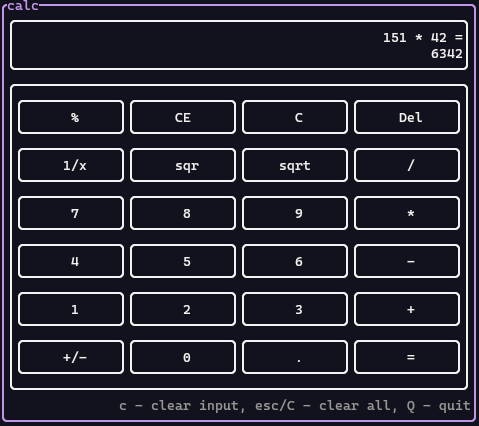

# Calc in terminal

Simple calc tui written on rust



## Installation

With cargo

```cmd
cargo install caltui
```

## Usage

```cmd
Options:
  -a, --altscreen  Run in altscreen
  -b, --big        Run with big text
  -h, --help       Print help
  -V, --version    Print version
```
