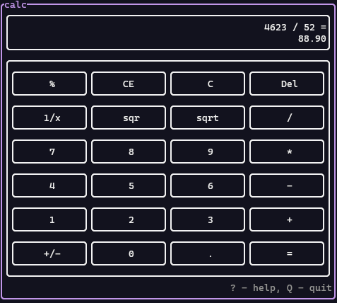

# Calc in terminal

Simple calc tui written in Rust



## Installation

With cargo

```cmd
cargo install caltui
```

## Usage

```cmd
caltui
```

## Usage options

```cmd
Options:
  -a, --altscreen  Run in altscreen
  -b, --big        Run with big text
```
